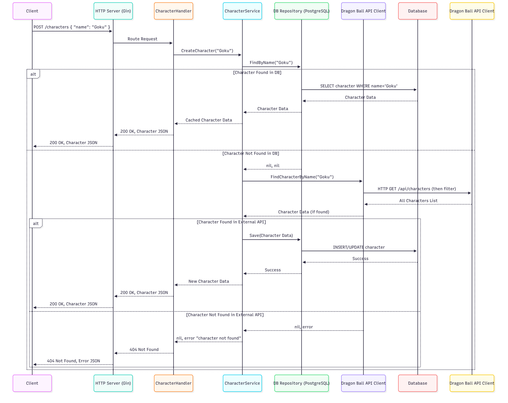

# backend.go.characters.api
Golang Microservice to get information about Dragon Ball characters

# Dragon Ball Character Service

This Go service allows you to create and store Dragon Ball character information, leveraging a hexagonal architecture, `log/slog` for logging, Gin for the web framework, and PostgreSQL for persistence. It interacts with an external Dragon Ball API to fetch character details.


Dragonball API Rest [dragonball-api docs](https://dragonball-api.com/api-docs "Official documentation of www.dragonball-api.com").

---

## 1. Architecture Diagram

Here's a sequence diagram illustrating the flow when a `POST /characters` request is made:




## 2. How to run this

- add an .env file with this environment variables, refer to .env.example file in the project

```
PORT=8080
DB_USER=user
DB_PASSWORD=password
DB_NAME=dragonballdb
DB_HOST=localhost
DB_PORT=5432
```

- In the root folder run this command to create the image, and run containers

```
cd /home/user/backend.go.characters.api

docker-compose up --build
```

## 3. Requirements

- Golang 1.22
- Docker desktop must by installed for local


## 4. Endpoint

/characters

Once Database and API containers are running, open a new terminal or use Postman to execute this kind of request:

```
curl -X POST -H "Content-Type: application/json" -d '{"name": "Goku"}' http://localhost:8080/characters
```